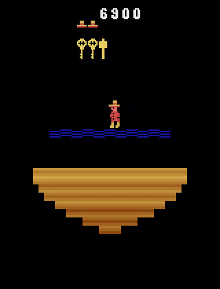
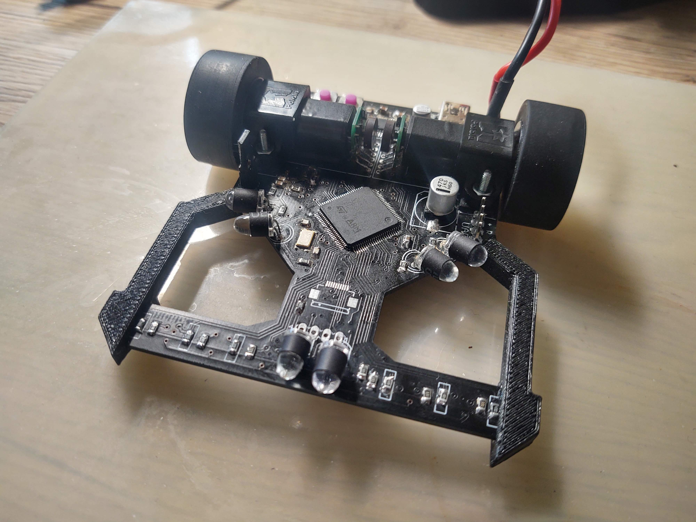
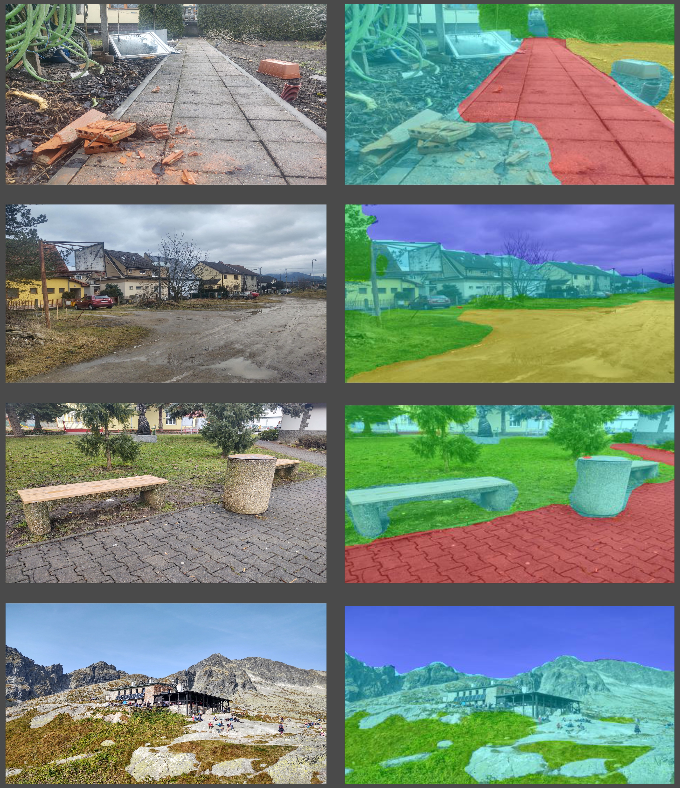

# some nice repos 

## [reinforcement learning agents](https://github.com/michalnand/reinforcement_learning_agents)

- state of the art results on infamous Montezuma's revenge
- paper [Exploration by self-supervised exploitation](https://arxiv.org/abs/2302.11563)

- video [youtube : Exploration by self-supervised exploitation](https://www.youtube.com/watch?v=-vDg_r2ZetI)

  

## [LibsControll](https://github.com/michalnand/libs_control)

 

## [motoko line following robot](https://github.com/michalnand/motoko_uprising_new)

 

## [image segmentation with tiny conv net for outdoor robot](https://github.com/michalnand/classification/tree/master/experiments/outdoor)

 
